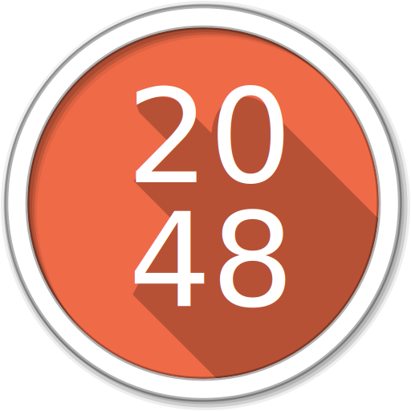

<a name="readme-top"></a>

<h1 align="center">Welcome to 2048 - Game 👋</h1>
<div align="center">

  
  
  
  
</div>

<!-- PROJECT LOGO -->
<br />
<div align="center">
  <a href="https://mpohorenyi.github.io/2048-Game/">
    
  </a>

  <h3 align="center">2048 game implemented in JavaScript</h3>

  <p align="center">
    <a href="https://mpohorenyi.github.io/2048-Game/">View Demo</a>
  </p>
</div>

<!-- TABLE OF CONTENTS -->
<details>
  <summary>Table of Contents</summary>
  <ol>
    <li>
      <a href="#about-the-project">About The Project</a>
    </li>
    <li>
      <a href="#getting-started">Getting Started</a>
      <ul>
        <li><a href="#prerequisites">Prerequisites</a></li>
        <li><a href="#installation">Installation</a></li>
        <li><a href="#usage">Usage</a></li>
      </ul>
    </li>
    <li><a href="#author">Author</a></li>
  </ol>
</details>

<!-- ABOUT THE PROJECT -->
## About The Project
<div align="center">

  
</div>

This project appears to be a JavaScript implementation of the game 2048. The 2048 game is a single-player sliding block puzzle game. The game's objective is to slide numbered tiles on a grid to combine them to create a tile with the number 2048.

Here's a brief description of the project structure:

`game.js`: This file contains the logic for the game. It has a class Game with methods to move the tiles in all four directions (up, down, left, right), check if the game is over or won, add a new random cell, and reset the game. It also keeps track of the game score.

`main.js`: This file is responsible for interacting with the DOM. It uses the Game class from game.js to control the game based on the user's input. It also updates the game's visual representation on the web page based on the game state.

The project also seems to be implementing some animations for the game.

The game starts with two random cells, and the player can use the arrow keys to slide all the tiles in one direction. When two tiles with the same number touch, they merge into one with a number that is the sum of the two original numbers. A new random cell is added after each move. The game is won when a cell reaches the number 2048, and it's over when there are no empty cells and no adjacent cells with the same number.

<!-- GETTING STARTED -->
## Getting Started

To get a local copy up and running, follow these steps:

### Prerequisites

Make sure you are using the correct version of the node
* node 14.21.3

### Installation

1. Clone the repo
  ```sh
  git clone https://github.com/mpohorenyi/MyBike-Landing-Page.git
  ```
2. Install NPM packages
  ```sh
  npm install
  ```

<!-- USAGE EXAMPLES -->
### Usage

To start the project, use the following command: <br />
  ```sh
  npm start
  ```

## Author

* Github: [@mpohorenyi](https://github.com/mpohorenyi)
* LinkedIn: [Mykhailo Pohorenyi](https://www.linkedin.com/in/mykhailo-pohorenyi/)
* Telegram: [@mpohorenyi](https://t.me/mpohorenyi)
* Gmail: mykhailo.pohorenyi@gmail.com

<p align="right">(<a href="#readme-top">UP</a>)</p>
